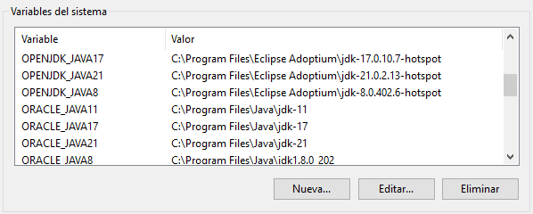

# change-java

Este script cambia la version de java que se ejecuta en el sistema, teniendo efecto en la sesion activa de la consola que lo ejecute.

## Tabla de contenido
- [change-java](#change-java)
  - [Tabla de contenido](#tabla-de-contenido)
  - [Empezando](#empezando)
      - [1. Definir variables de entorno (Opcional)](#1-definir-variables-de-entorno-opcional)
      - [2. Ejecución](#2-ejecución)
      - [3. Ejemplo](#3-ejemplo)

## Empezando

Para la ejecución del script seguir los siguientes pasos:

#### 1. Definir variables de entorno (Opcional)

Al tener multiples versiones de JRE/JDK de Java resulta conveniente el tener las rutas en forma de variables de entorno para proporcionarlas de forma sencilla.

Ingresando al cuadro de texto de las Variables de entorno ( Panel de control > Sistema > Configuración avanzada del sistema > Variables de entorno ), dependiendo los permisos de acceso que se tenga en el sistema pueden ser variables del sistema o en su defecto, de usuario.

Por cada ruta de java que se tenga, seleccionar __Nueva...__ , ingresar el nombre de la variable (sin espacios) y la ruta de la instalacion de java (sin el \bin). Una vez ingresadas todas las variables seleccionar __Aceptar__.

Por último, podemos comprobar su aplicación abriendo una consola de línea de comandos:

~~~batch
echo %NOMBRE_DE_VARIABLE%
~~~

Si todo fue correcto se tendría una salida similar a:

~~~batch
C:\Users\jlmorab> echo %ORACLE_JAVA8%
C:\Program Files\Java\jdk1.8.0_202 
~~~

#### 2. Ejecución

El script recibe como parámetro la ruta de instalación de Java JRE/JDK por el que se desea cambiar, esta debe apuntar a la carpeta raiz de dicha instalación. Proporcionar el parámetro entre comillas para que en caso de tener algún espacio la ruta aún siga considerándose como un único parámetro.

~~~batch
change-java "[ruta-instalacion-java]"
~~~

> Puede incluir la ruta del batch en las variables de entorno para no tener que proporcionar su ruta de origen cada vez que lo ejecute (_véase [1. Definir variables de entorno (Opcional)](#1-definir-variables-de-entorno-opcional)_)

El script mostrará como salida la version de java equivalente a la ejecución de `java -version`

#### 3. Ejemplo

~~~batch
# Comprobación de versión actual del sistema (opcional)
C:\Users\jlmorab>java -version
java version "17.0.10" 2024-01-16
Java(TM) SE Runtime Environment (build 17.0.10+11-LTS-240)
Java HotSpot(TM) 64-Bit Server VM (build 17.0.10+11-LTS-240, mixed mode, sharing)

# Ejecución de script. Se utiliza variable de entorno para proporcionar ruta de java a utilizar
C:\Users\jlmorab>change-java "%ORACLE_JAVA8%"
java version "1.8.0_202"
Java(TM) SE Runtime Environment (build 1.8.0_202-b08)
Java HotSpot(TM) 64-Bit Server VM (build 25.202-b08, mixed mode)

# Comprobación manual de versión actual del sistema después de ejecución de script (opcional)
C:\Users\jlmorab>java -version
java version "1.8.0_202"
Java(TM) SE Runtime Environment (build 1.8.0_202-b08)
Java HotSpot(TM) 64-Bit Server VM (build 25.202-b08, mixed mode)
~~~